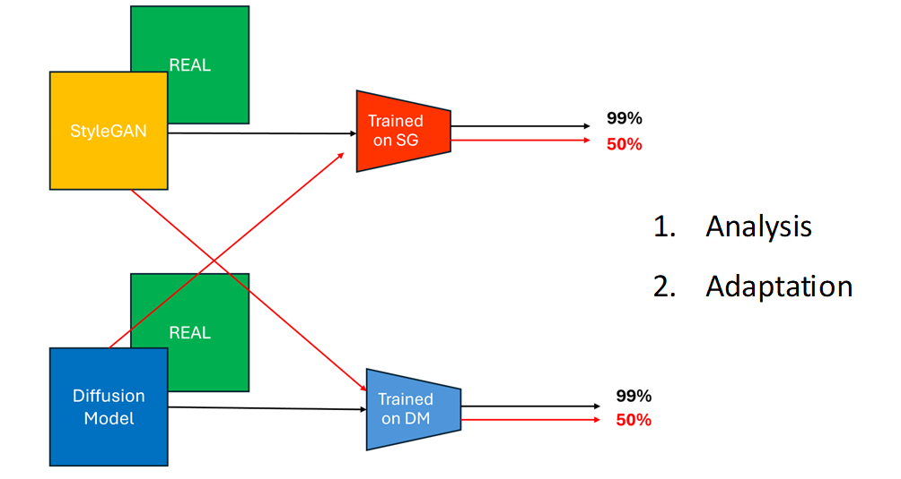

# Elaborato VMR 2025 (Towards Generalisation)

Titolo: Adattare rilevatori di deepfake per migliorare la generalizzazione

<p align="center">
  
</p>

Tipicamente classificatori binari addestrati a riconoscere immagini reali e fake mostrano prestazioni eccellenti (accuratezza molto alta) quando le immagini false sono della stessa tipologia di quelle adottate in fase di training. Tuttavia, in uno caso reale, in cui le immagini fake possono essere generate con implementazioni diverse non note a priori, lo stesso classificatore tende a etichettarle spesso come reali (accuratezza del 50%). Un tale scenario di valutazioni delle prestazioni, in cui viene testato un modello (classificatore) su una categoria di immagini fake differente da quella di training, è noto come cross-dataset. 
L’elaborato verte nell’investigare il caso cross-dataset per comprendere e spiegare meglio tale comportamento, fino a realizzare metodi di recovery della detection. In questo elaborato, si prendono in considerazione come fake, le immagini interamente generate (fully synthetic) mediante tecniche appartenenti a due macro famiglie (di generatori): GAN e Diffusion Model (DM). In particolare, si trattano, almeno in questa prima fase di studio, due tipologie di immagini fake: StyleGAN e Stable Diffusion SD v1.4. 

## 1. Obiettivo

Partendo da due modelli preaddestrati di classificatori, ognuno addestrato su una tipologia di fake, si vuole:
1.	[Analysis] Analizzare dissimilarità (come attivazioni GradCAM o similari) tra immagini reali e fake (viste o meno durante il training) nei vari livelli della rete del classificatore, per capire dove la rete mostra segni di incapacità nel distinguere real e fake (fino a che livello la rete vede differenze tra real e un fake generico?);
2.	[Adaptation] Applicare metodi che possano aiutare la rete a “ripristinare” il più possibile il funzionamento del classificatore binario real-fake.

## 2. Riferimenti
- StyleGAN: [Paper](https://arxiv.org/pdf/1812.04948) [Github](https://github.com/NVlabs/stylegan)
- Denoising Diffusion Probabilistic Model (DDPM): [Paper](https://arxiv.org/pdf/2006.11239) [Github](https://github.com/CompVis/latent-diffusion)
- Stable Diffusion (SD) Model: [Paper](https://openaccess.thecvf.com/content/CVPR2022/papers/Rombach_High-Resolution_Image_Synthesis_With_Latent_Diffusion_Models_CVPR_2022_paper.pdf) [Github](https://github.com/CompVis/latent-diffusion)
- GradCAM: [Paper](https://arxiv.org/abs/1610.02391) [Github](https://github.com/jacobgil/pytorch-grad-cam)

## 3. Per iniziare
   **Tutti gli esperimenti sono testati su Linux OS 22.0.4 LTS, con Python 3.10.16.**
   
### 3.1. Clona il Github

 ```sh
 git clone https://github.com/aciam1/VMR-2025
 ```
	
  Scarica i modelli preaddestrati da [qui](https://drive.google.com/file/d/1pgEfMGcDztpPXupiuX33wzfjehHYLIMa/view?usp=drive_link) e scompatta direttamente la cartella.
   
### 3.2. Conda Environment

   Per creare automaticamente l'ambiente conda di lavoro ed i pacchetti, è sufficiente eseguire lo script bash `create_and_configure_env.sh`, indicando il nome dell'ambiente (e.g. vmr2025):
   
```sh
bash ./create_and_configure_env.sh vmr2025
```
   Alternativamente si può prima creare un ambiente conda con python 3.10.16, poi installare i pacchetti usando lo script bash `install_requirements.sh`: 
	
```sh
conda create -n myenv python=3.10.16
conda activate myenv
bash ./install_requirements.sh
```
	
### 3.3. Esperimenti

> [!NOTE] 
> Assicurarsi che in [config.py](config.py):
>
> I. `DATASET_DIR` punti alla directory root delle immagini `FFHQ`
>
> II. `CHECKPOINT_DIR` punti alla directory `checkpoint`, i.e. dove ci sono i modelli preaddestrati.

Per eseguire un esperimento, lanciare lo script `bin_classifier.py` e verificarne il funzionamento con eventuali altri parametri da passare (i.e. batch_size e num_workers).
   
Il parametro `--train` viene utilizzato per selezionare nella cartella `checkpoint` il modello preaddestrato sullo specifico metodo di generazione.

Il parametro `--test` specifica quali immagini AI-generated vengono impiegate a test set.

Per entrambi i parametri `--train` e `--test` si veda `config.py`.

Le immagini reali sono [FFHQ](https://github.com/NVlabs/ffhq-dataset)   
   
#### 3.3.1. Performance IN-dataset 
  
Le immagini di training e test set provengono dallo stesso generatore (stesso metodo di generazione).

```sh
conda activate vmr2025
cd VMR-2025
python bin_classifier.py --train stylegan1 --test stylegan1
python bin_classifier.py --train stylegan2 --test stylegan2	
```
	
| TRAIN |  TEST |  ACC  |
| :---: | :---: | :---: |
| stylegan1 | stylegan1 | 0.999100 |
| stylegan2 | stylegan2 | 0.999150 |

#### 3.3.2. Performance CROSS-dataset

Le immagini di training e test set NON provengono dallo stesso generatore (metodo di generazione usato a test diverso da quello visto durante il training). 
    
```sh
conda activate vmr2025
cd VMR-2025
python bin_classifier.py --train stylegan1 --test stylegan2
python bin_classifier.py --train stylegan2 --test stylegan1
```
	
| TRAIN |  TEST |  ACC  |
| :---: | :---: | :---: |
| stylegan1 | stylegan2 | 0.579750 |
| stylegan2 | stylegan1 | 0.695950 |
